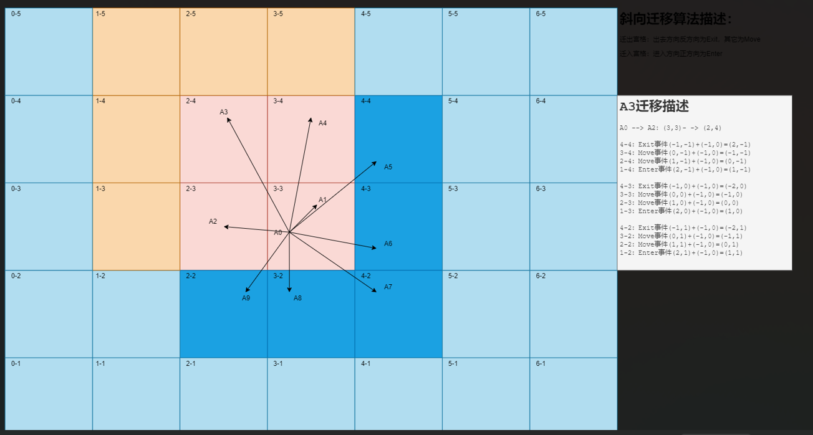
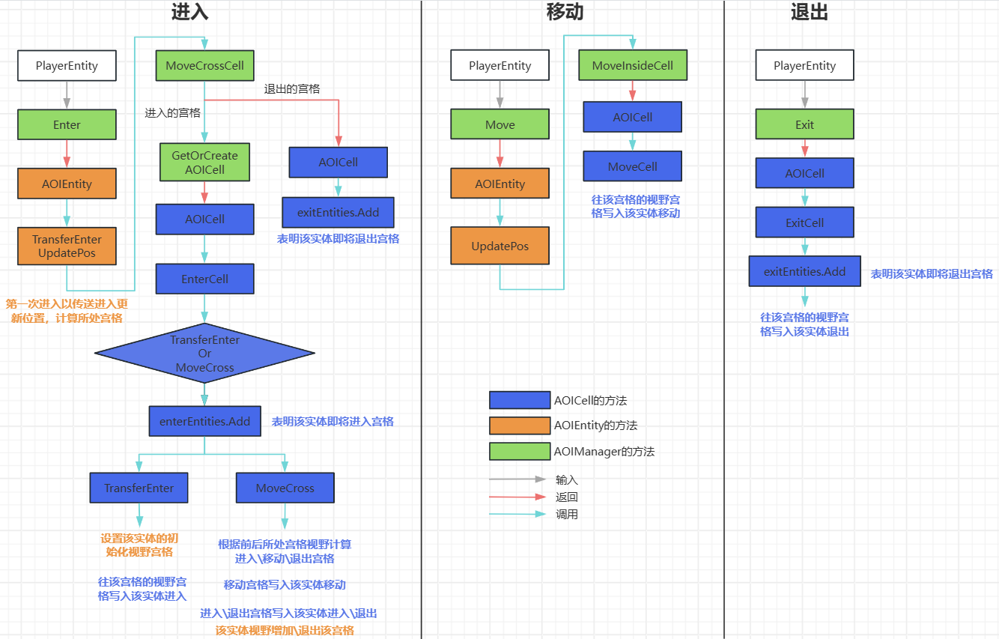

# AOI 算法

## AOIManager

调度器

- 负责管理 `Dictionary<string, AOICell> cells`、创建宫格 `GetOrCreateAOICell`，并负责管理实体 `List<AOIEntity> entities`
- 负责计算全部实体的视野变化，以及全部宫格的视野变化 `CalcAllEntitiesAOIChange`

<a href="#其执行从一个实体第一次进入然后移动最终退出的完整逻辑">其执行从一个实体第一次进入，然后移动，最终退出的完整逻辑</a>

## AOIEntity

AOI 层的实体对象，负责和 `AOICell` 和 `AOIManager` 交互，当场景中的对象（玩家、怪物等）第一次进入场景时创建出来

- 继承过来的基本属性：位置、ID
- 当前所在宫格索引、上一个宫格索引
- 移动类型：传送进入、传送离开、跨越宫格、在宫格内部移动
- 驱动模式：客户端玩家、服务端怪物等

### 同样需要监听其视野宫格的变化

- `AOICell[9] aroundCells` 初始化视野宫格，为 9 个
- `List<AOICell> removeCells` 退出视野宫格
- `List<AOICell> addCells` 增加视野宫格

在方法 `CalcEntityCellViewChange` 里面计算该实体视野范围内宫格  ---> 里面的实体的进入退出，组成一个 `AOICellUpdateContainer` 返回给客户端。
由 `AOIManager.CalcAllEntitiesAOIChange` 进行调度

## AOICell

虚拟出来的 AOI 的宫格，和真实场景地形无关，其形状可以自行设计，为了计算方便，一般都是正方形（在 NavMesh 里面是根据地形烘培出多边形区域，而这里不需要）

- 动态生成，`AOIEntity` 走到哪，`AOIManager` 生成到哪
- 生成该宫格时预先生成周围两圈，内一圈作为该宫格的视野 `AOICell[9] Arounds`
- 需要记录哪些实体在该宫格内，但并不是直接添加删除，而是先缓冲起来，再每帧计算的时候统一处理    
  - `HashSet<AOIEntity> entities` 已经处于该宫格的实体
  - `HashSet<AOIEntity> enterEntities` 即将进入该宫格的实体
  - `HashSet<AOIEntity> exitEntities` 即将退出该宫格的实体


### 同样需要监听其实体变化

- `List<EnterEvent> enterEvents` 哪些实体进入
- `List<MoveEvent> moveEvents` 哪些实体移动
- `List<ExitEvent> exitEvents` 哪些实体退出

注意这里的进入、移动、退出并不单单是实体真的进入\移动\退出该宫格，而是指实体进入\移动\退出该宫格视野，例如下面



假设原来在 3-3 宫格的 A0 实体迁移到了 2-4 这个宫格，那么该实体

- 对于右下角的 5 个蓝色宫格就是该实体退出了，同时相对的，<a href="#同样需要监听其视野宫格的变化">该实体也要写入退出了这 5 个宫格的视野范围 </a>
- 对于左上角的 5 个橙色宫格就是该实体进入了，同时相对的，<a href="#同样需要监听其视野宫格的变化">该实体也要写入增加了这 5 个宫格的视野范围 </a>
- 而中间浅色的 4 个宫格就是该实体移动了

这种跨越宫格计算进入\移动\退出可以通过跨域前后的宫格视野集合，通过并差操作得出

在方法 `CalcCellOP` 里面将监听的实体的变化，发送给该宫格里面的每一个实体。由 `AOIManager.CalcAllEntitiesAOIChange` 进行调度

## AOICellUpdateContainer

计算某个实体视野的结果，也是返回给客户端的结果

- `List<EnterEvent> enterEvents` 哪些实体进入，进入的位置
- `List<MoveEvent> moveEvents` 哪些实体移动，移动的位置
- `List<ExitEvent> exitEvents` 哪些实体退出

## 其执行从一个实体第一次进入，然后移动，最终退出的完整逻辑



## CalcAllEntitiesAOIChange

在服务端每帧 Tick 中进行驱动，汇总全部实体的视野计算结果，返回给客户端

```c#
public void CalcAllEntitiesAOIChange()
{
  for (int i = 0; i < entities.Count; i++)
    entities[i].CalcEntityCellViewChange();

  foreach (var item in cells)
  {
    AOICell aoiCell = item.Value;

    if (aoiCell.exitEntities.Count > 0)
    {
      // 剔除退出的实体
      aoiCell.entities.ExceptWith(aoiCell.exitEntities);
      aoiCell.exitEntities.Clear();
    }

    if (aoiCell.enterEntities.Count > 0)
    {
      // 合并新进入的实体
      aoiCell.entities.UnionWith(aoiCell.enterEntities);
      aoiCell.enterEntities.Clear();
    }

    aoiCell.CalcCellOP();
  }
}
```

- `CalcEntityCellViewChange`：根据初始视野、增加视野、退出视野宫格里面的实体，作为该实体的视野
  - 初始视野宫格、增加视野宫格里面的实体都添加到 `List<EnterEvent> enterEvents`
  - 退出视野宫格里面的实体都添加到 `List<ExitEvent> exitEvents`

- 单个实体计算完成后，才能对宫格里面的即将进入\退出的实体进行合并\剔除

- `CalcCellOP`：直接把该宫格里面收集的视野，发送给该宫格里面的全部实体

- `CalcEntityCellViewChange` 和 `CalcCellOP` 每次驱动后都要清空状态

## 剔除无用视野

主要是根据 `AOIEntity` 的驱动模式，只有客户端的玩家实体才需要计算视野并返回，服务端的怪物等实体不需要

- 对于 `AOICell`：该宫格有客户端实体关注，并且该宫格里面有客户端实体，才需要计算发送视野
- 对于 `AOIEntity`：确保所处宫格有客户端实体关注，并且自身是客户端实体，才需要计算发送视野

【该宫格有客户端实体关注】这个条件可以省略，因为【该宫格里面有客户端实体】和 【自身是客户端实体】都已经确保其成立